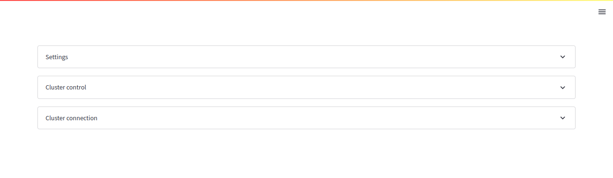
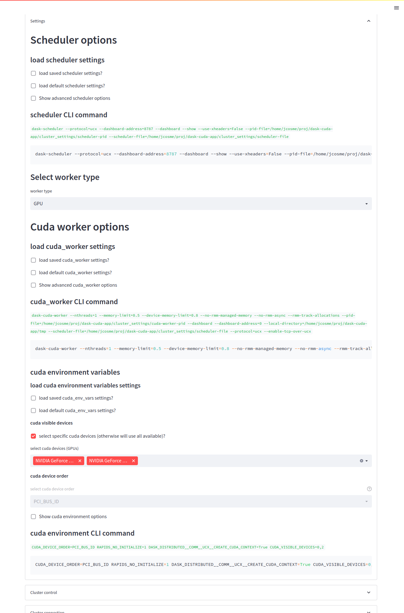
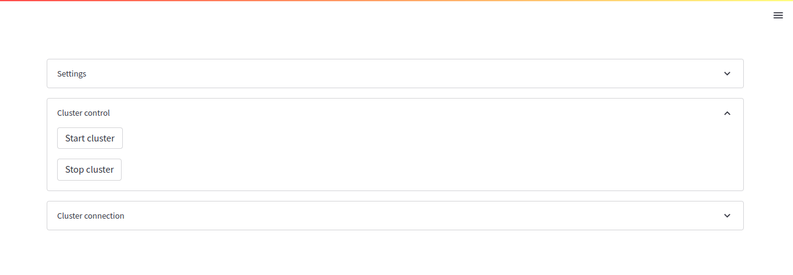
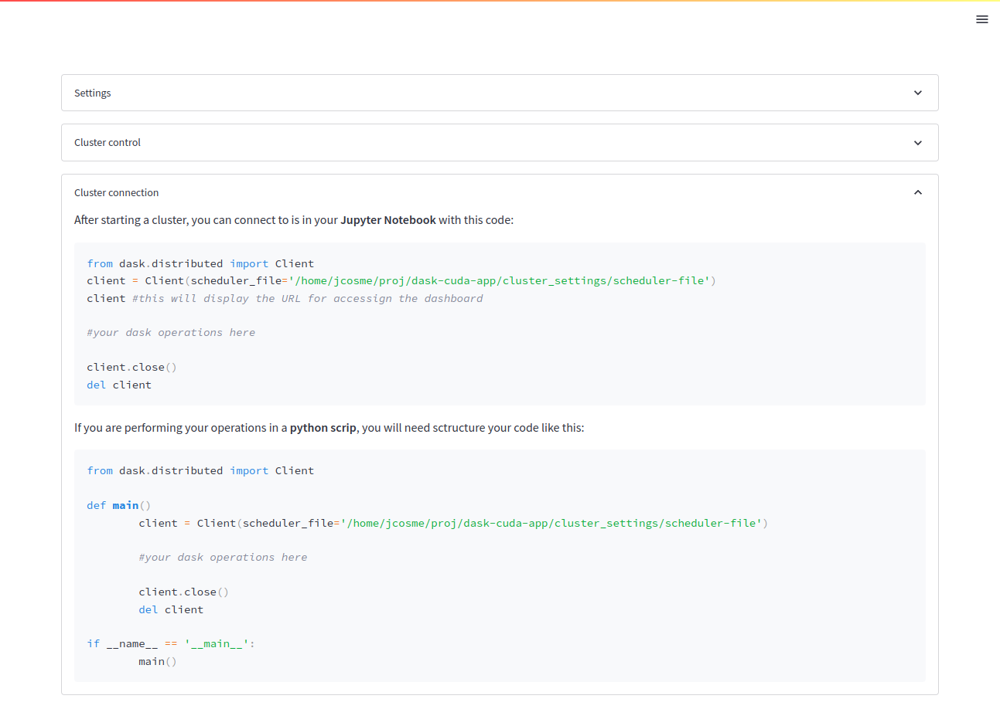

# Dask cuda app  

## Description  
  
This application is designed to contruct dask-cuda (GPU) clusters using only the CLI. 
The intention was to create an app that could create a multi-machine GPU Dask cluster (the dask-cuda python API can only create local clusters).  
It is a work in progress and will continue to be updated as more features are added. 

## Current features

+ An interactive UI for visualizing and setting all possible arguments for the Dask CLI, including:
	+ dask-scheduler
	+ dask-worker
	+ dask-cuda-worker
+ Ability to start a cluster
+ Ability to stop a cluster
+ Generated code for how to connect to a running dask cluster for:  
	+ Jupyter notebooks
	+ python scripts

## Screenshots
  
  
  
  
  
  
  
  